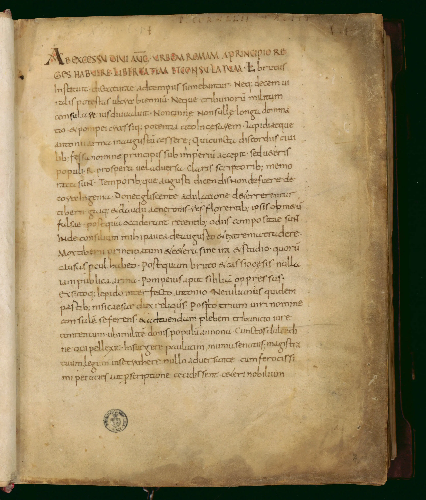

*Folio 2r del manuscrito Plut.68.1 conservado en la Biblioteca Medicea Laurenziana donde puede verse la transcripción en latín del primer párrafo del libro primero.*

## Descripción del objeto

- **Identificador:** IT:FI0100_Plutei_68.01  
- **Título:** *Cornelius Tacitus*  
- **Autor:** Cornelius Tacitus  
- **Descripción:** Sin fecha explícita  
- **Datación:** 1001–1100  
- **Tipo:** Manuscrito  
- **Formato:** Pergamino; 190 × 240 mm; 138 cuadernos  
- **Signatura:** Plut.68.1  
- **Derechos de acceso:** Público  

### Ficha de catálogo

> *Catalogus codicum Latinorum Bibliothecae Mediceae Laurentianae sub auspiciis Petri Leopoldi ... Ang. Mar. Bandinius i.v.d. ... recensuit illustravit edidit. Tomus 1. [- 5.]. Tomus 2. in quo grammatici, rethores, philologi, poetae, historici, cosmographi, astronomi, tam veteris quam recentioris aevi accuratissime recensentur …*  
> Referencia: {IT\ICCU\RAVE\006303} {{431}}

- **IIIF Manifest:** [Ver Manifest JSON](https://tecabml.contentdm.oclc.org/iiif/info/plutei/1334704/manifest.json)

---

## Descripción del ítem

- **Título:** Folio 2r  
- **Imágenes digitalizadas originales:**  
  - [Imagen 1 – 2r](https://tecabml.contentdm.oclc.org/digital/iiif/plutei/1334411/full/full/0/default.jpg)  
  - [Imagen 2 – 2r](https://tecabml.contentdm.oclc.org/digital/iiif/plutei/1334412/full/full/0/default.jpg)
